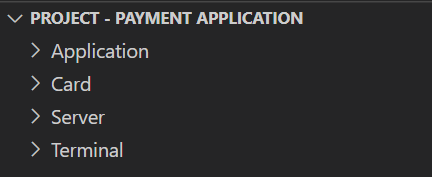
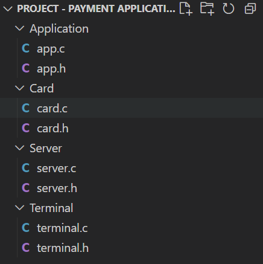
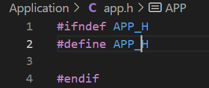
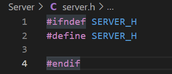
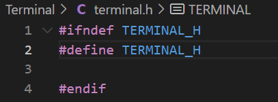
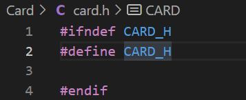
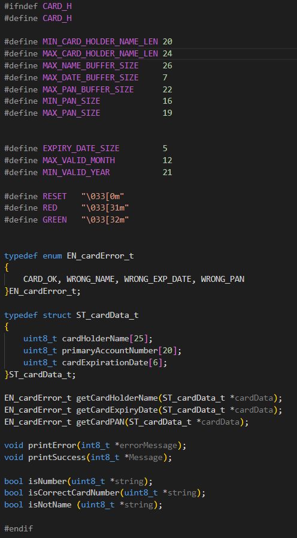

# Project 1 : Payment Application

## Development environment preparation
### Create modules folders

### Create .c and .h file for each module

### Add header file gaurd

## Implement the card module
### Fill in card.h file with functions' prototypes and typedefs

### Implement getCardHolderName function
https://user-images.githubusercontent.com/40808151/185782062-e10481df-2bdd-4c71-ba73-f7a5b5ab428e.mp4
### Implement getCardExpiryDate function
https://user-images.githubusercontent.com/40808151/185782973-d7aadb25-3a04-408f-9b73-4b428a0a329c.mp4
### Implement getCardPAN function
https://user-images.githubusercontent.com/40808151/185929444-4be836ba-7102-41c5-b044-702885c65df6.mp4
