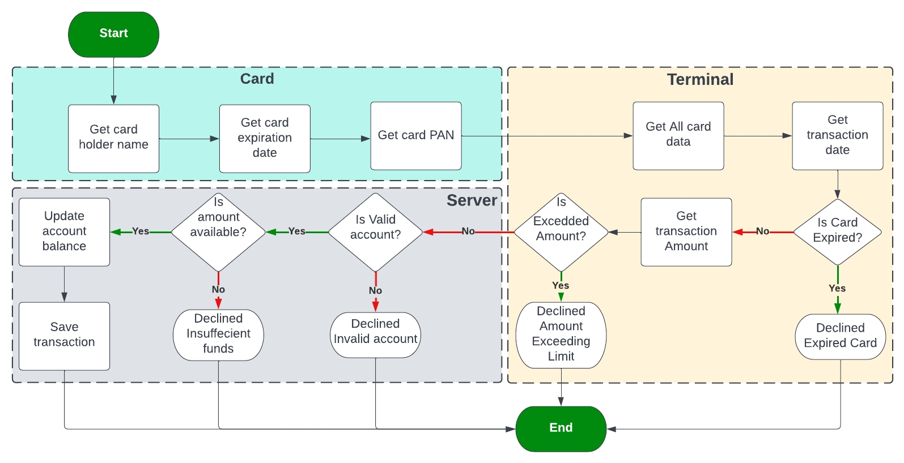
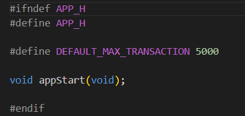

# Project 1 : Payment Application

## Application Flowchart

  
Development environment preparation

  ### Create modules folders
  
  ### Create .c and .h file for each module
  
  ### Add header file gaurd
  
  
  
  

## Implement the Card module

  
Card Module

  ### Fill in card.h file with functions' prototypes and typedefs
  
  ### Implement getCardHolderName function
  https://user-images.githubusercontent.com/40808151/185782062-e10481df-2bdd-4c71-ba73-f7a5b5ab428e.mp4
  ### Implement getCardExpiryDate function
  https://user-images.githubusercontent.com/40808151/185782973-d7aadb25-3a04-408f-9b73-4b428a0a329c.mp4
  ### Implement getCardPAN function
  https://user-images.githubusercontent.com/40808151/185929444-4be836ba-7102-41c5-b044-702885c65df6.mp4

## Implement the Terminal module

  
Terminal Module

  
  ### Fill in terminal.h file with functions' prototypes and typedefs
  
  ### Implement getTransactionDate function
  https://user-images.githubusercontent.com/40808151/185932506-90804e4f-751b-46b5-8da9-002c34bc7a37.mp4
  ### Implement isCardExpried function
  https://user-images.githubusercontent.com/40808151/185942241-2f5ff175-72fa-4da5-b6d9-32215dbe7278.mp4
  ### Implement gatTransactionAmount function
  https://user-images.githubusercontent.com/40808151/185945385-32f9f740-ca64-49d7-a06e-2afa69b60ec4.mp4
  ### Implement isBelowMaxAmount function
  https://user-images.githubusercontent.com/40808151/185947227-8c63ffd8-8aeb-4459-8231-e14ba9d506a2.mp4
  ### Implement setMaxAmount function
  https://user-images.githubusercontent.com/40808151/185949845-2c364496-14e0-495c-ab0a-e9c459ea67a3.mp4

## Implement the Server module

  
Server Module

  
  ### Fill in server.h file with functions' prototypes and typedefs
  
  ### Implement server-side accounts' database
  #### A screenshot from the csv file created:
  
  ### Implement server-side transactions' database
  #### A screenshot from the csv file created with no transactions:
  
  #### A screenshot from the csv file created with some transactions:
  
  ### Implement recieveTransactionData function
  https://user-images.githubusercontent.com/40808151/186133362-61421325-cf1c-4933-9c7d-3836d66e14e3.mp4
  ### Implement isValidAccount function
  https://user-images.githubusercontent.com/40808151/186134659-7f9b0aa8-91ae-4dc4-9840-166ce9a73f8a.mp4
  ### Implement isAmountAvailable function
  https://user-images.githubusercontent.com/40808151/186135803-612d0cf6-66d5-4dbe-a847-bb71d8ac74b3.mp4
  ### Implement saveTransaction function
  https://user-images.githubusercontent.com/40808151/186137600-97f70805-3c13-4474-950b-2b5288aa8ce3.mp4
  ### Implement getTransaction function
  https://user-images.githubusercontent.com/40808151/186138988-582f8555-a1e4-4cfe-acf8-9fb70c0b1e9b.mp4
  ## Utility functions:
  ### Implement loadData function
  https://user-images.githubusercontent.com/40808151/186140964-49be9abe-7015-449e-a719-29a499a8126a.mp4
  ### Implement getTransactionSequenceNumber function
  https://user-images.githubusercontent.com/40808151/186142128-c84017b6-dae2-46e9-a79d-1536aa6f87b2.mp4
  ### Implement saveAccountData function
  https://user-images.githubusercontent.com/40808151/186143033-d8476546-6ec7-47f8-8d4f-b693ca218bae.mp4

## Implement the application

  
Application

  
  ### Fill in application.h file with functions' prototypes
  
  ### Implement appStart function
  https://user-images.githubusercontent.com/40808151/186147966-c26d6eb0-d7f8-4406-8f4e-a419504c36f7.mp4

## Testing the application

  
Testing

  
  ### Transaction approved user story
  https://user-images.githubusercontent.com/40808151/186152543-690af6fb-e427-486a-abe7-d07baa2319ee.mp4
  

